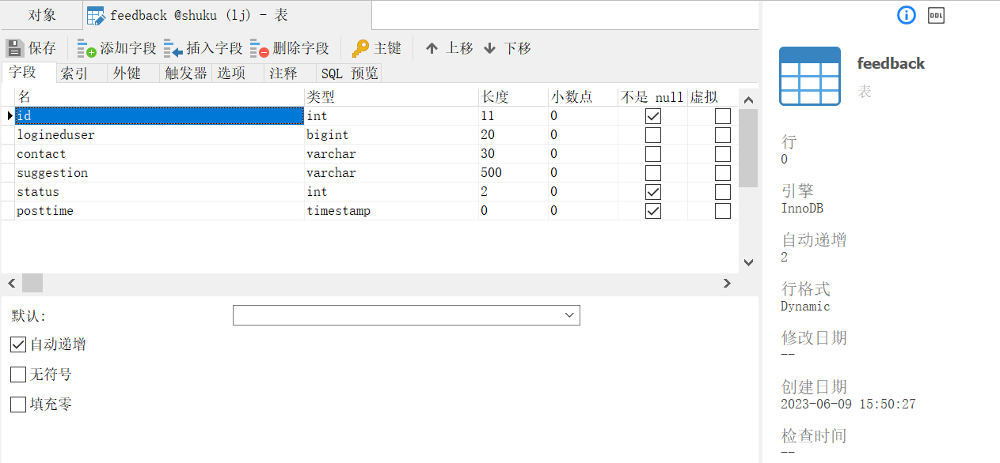
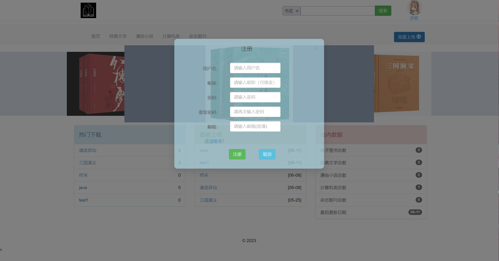

# 书酷网:wink:
## 项目文件夹构成::scroll::blush::yum:
### 前台网站：javaeeproj
### 后台前后端分离：
#### —————前端：shukuglym
#### —————后台：shukuglymht
## 基本功能描述:grin:
  书酷项目分为六个模块，分别为标题栏模块、书籍展示模块、书籍搜索模块、书籍上传模块、个人信息模块和后台管理模块。
### （1）标题栏模块
标题栏模块分为标题logo、搜索栏和用户栏三个组件。标题logo在标题栏的左侧，搜索栏在标题栏的中间，可以搜索全站书籍。用户栏在标题栏的右侧，单击头像可进入个人信息管理，鼠标悬停在用户头像上用户信息栏展开，用户信息栏展开，会显示等 级和贡献值，在未登录的情况下会显示登录和注册按钮，点击登录和注册框会对应弹出，登录和注册框均可拖动。在已登录的情况下，会显示注销，点击注销，即可退出登录。
### （2）副标题栏模块
副标题栏模块分为书籍分类导航链接和“我要上传”按钮两个组件。书籍分类导航链接在副标题栏的左侧，单击每个分类导航链接可以跳转到相应的分类页面。“我要上传”按钮在标题栏的右侧，单击“我要上传”按钮，可以跳转到相应的上传页面。
### （3）轮播模块
   轮播模块在副标题栏的下面，轮播书籍信息，根据需求，可以轮播对应个数的书籍信息。
### （4）书籍展示模块
   书籍展示模块分为书籍列表、书籍分类展示页和书籍详情页三个部分。书籍列表处于首页的中央，分为热门下载、最新上传和站内数据三个部分。热门下载展示的是图书下载次数的排行，最新上传展示的是最近上传的图书，站内数据展示的是各个分类的图书总数。书籍分类展示页是一个新页面，单击标题栏模块中相应的分类导航链接，可以跳转到书籍分类展示页，它负责展示每个图书种类的列表。书籍详情页负责展示图书的具体信息。
### （5）书籍搜索模块
   书籍搜索模块分为搜索框和搜索结果页。搜索框存在于多个页面，在首页的搜索框中输入需要搜索的图书名，即可跳转到搜索结果页，在搜索结果页单击每本书的书名即可跳转到相应的书籍详情页。
### （6）书籍上传模块
   书籍上传模块，首页的“我要上传”，单击后可以跳转到书籍上传页。在页面中填写好图书信息，选择相应的图书文件，单击“提交”按钮即可上传。
### （7）个人信息模块
   个人信息模块用于查看和修改个人信息。单击首页标题栏中的头像，弹出的快捷框中单击“个人资料”即可跳转个人信息页。个人信息页分为标题栏、左侧的导航列表和右侧的展示框。在个人信息页中，可以通过左侧的导航栏列表，可以查看个人信息、修改个人信息、修改密码、查看上传历史和提交反馈建议。
### （8）后台管理模块
   后台管理模块，有两种不同风格的后台管理页面，访问后台管理网页地址，使用给定的账户登录系统后即可进入后台管理页。第一个后台管理模块具有用户管理、上传管理、头像管理、反馈处理、等级管理、书籍管理、书籍类型管理七个功能，第二个后台管理模块具有书籍管理、用户管理和反馈处理三个功能。  
## 流程图	:brain::monocle_face:

##### 图1.2.1 分类功能及其结构
在开发过程中，需要确定项目中的实体类对象，在根据实体类之间的关系创建数据库表，并确定好实体类对象的关系模型图，直观的显示出实体于属性之间的关系。下图只展示主要的两个实体E-R设计图

##### 图 1.2.2 书籍实体E-R设计图

##### 图 1.2.3 书籍分类实体E-R设计图
## 数据库设计:confused:

##### 图1.3.1 user(用户)表结构图

##### 图1.3.2 upload(上传)表结构图

##### 图1.3.3 feedback(反馈)表结构图

##### 图1.3.4 contribution(等级)表结构图

##### 图1.3.5 book_type(书籍类型)表结构图

##### 图1.3.6 book(书籍)表结构图

##### 图1.3.7 avatar(头像)表结构图
## 程序运行结果:eyes::eyes:
### 主站：

##### 图1.4.1未登录主页面

##### 图1.4.2登录界面
 &nbsp;   
##### 图1.4.3-1.4.4用户信息栏
 &nbsp;  &nbsp; 
##### 图1.4.5-1.4.7登录和注册弹窗

##### 图1.4.8书籍详情

##### 图1.4.9书籍分类页

##### 图1.4.10搜索页

##### 图1.4.11个人信息页

##### 图1.4.12修改头像页

##### 图1.4.13修改密码页
### 后台1：

##### 图1.4.14后台登录页

##### 图1.4.15后台
### 后台2：

##### 图1.4.16后台登录

##### 图1.4.17后台
## 设计总结:writing_hand::v::clap:
#### 1.技术栈选择：
使用Vue框架作为前端技术栈，能够构建现代化的、响应式的单页应用，提供更好的用户体验和开发效率。
使用Spring Boot作为后端技术栈，能够快速搭建和部署服务端应用，并提供丰富的生态系统和开发工具。
#### 2.学习和独立开发：
作为个人开发部分，你需要深入学习Vue框架、MyBatis、Spring Boot和Lombok插件的相关知识，熟悉它们的用法和特性。
你需要自主解决问题和寻找技术资料，掌握前端和后端的开发流程，并与前台团队进行良好的沟通和协作。
#### 3、接口对接和数据交互：
前后台通过定义和遵循一致的接口规范来进行数据交互。
在你的部分中，你需要设计和实现接口，与前台进行数据对接，确保数据的正确传递和展示。
#### 4.引入Lombok插件：
Lombok插件可以简化Java代码的编写，提高开发效率。
在你的开发过程中使用Lombok插件，可以自动生成Getter、Setter、Constructor等常用的代码，减少样板代码的编写。
#### 5.版本控制和项目管理：
使用版本控制工具（如Git）管理你的代码，与团队成员进行代码同步和协作。
在项目管理工具中进行任务的管理和跟踪，与团队共同推进项目的进展。
#### 6.学习和总结：
在个人开发过程中，遇到问题时要及时学习和解决，不断提升自己的技术能力。
定期进行项目总结和经验分享，记录我的收获和教训，为以后的开发提供参考。
这个课程设计项目提供了一个很好的机会，让我有机会独自开发一个部分，并与团队进行协作，加深对前端和后端技术栈的理解和应用。
